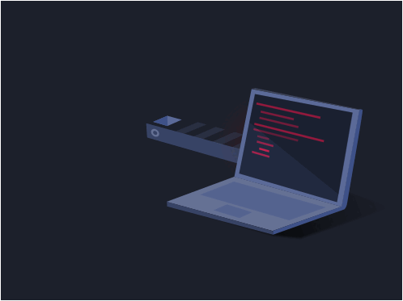
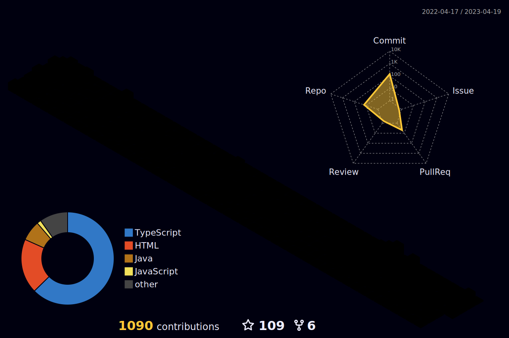

# Long Days and Pleasant Nights!

  

### Hello there, welcome to my humble Github Page.
My name is Alan (he/him).

I am a soul and spirit passionate about design, technology, and solving problems. I strive to never let go of the part of myself that is extremely curious and inquisitive, aiming to better understand the world and all the different people who live in it.

Software Engineer

## Tech Stack

## Design Stack

## Social Links

 

## Stats

<!--
**Alan-A-Andrade/Alan-A-Andrade** is a ✨ _special_ ✨ repository because its `README.md` (this file) appears on your GitHub profile.

Here are some ideas to get you started:

- 🔭 I’m currently working on ...
- 🌱 I’m currently learning ...
- 👯 I’m looking to collaborate on ...
- 🤔 I’m looking for help with ...
- 💬 Ask me about ...
- 📫 How to reach me: ...
- 😄 Pronouns: ...
- ⚡ Fun fact: ...
  -->
