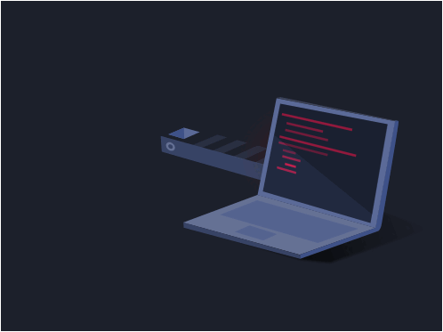

# Long Days and Pleasant Nights!

  

### Hello there, welcome to my humble Github Page.
My name is Alan (he/him),

A soul and spirit passionate about design, technology and solving problems.
I strive to never let go of the part of myself who is extremely curious and inquisitive, to better understand the world, and all the different people that live in it.

Full Stack Developer, familiar with JS, TS, CSS, HTML, React, Redux, NodeJs,Prisma, TypeORM, MongoDB, SQL, NestJS

## Tech Stack

## Social Links

 

<!--
**Alan-A-Andrade/Alan-A-Andrade** is a ✨ _special_ ✨ repository because its `README.md` (this file) appears on your GitHub profile.

Here are some ideas to get you started:

- 🔭 I’m currently working on ...
- 🌱 I’m currently learning ...
- 👯 I’m looking to collaborate on ...
- 🤔 I’m looking for help with ...
- 💬 Ask me about ...
- 📫 How to reach me: ...
- 😄 Pronouns: ...
- ⚡ Fun fact: ...
-->
